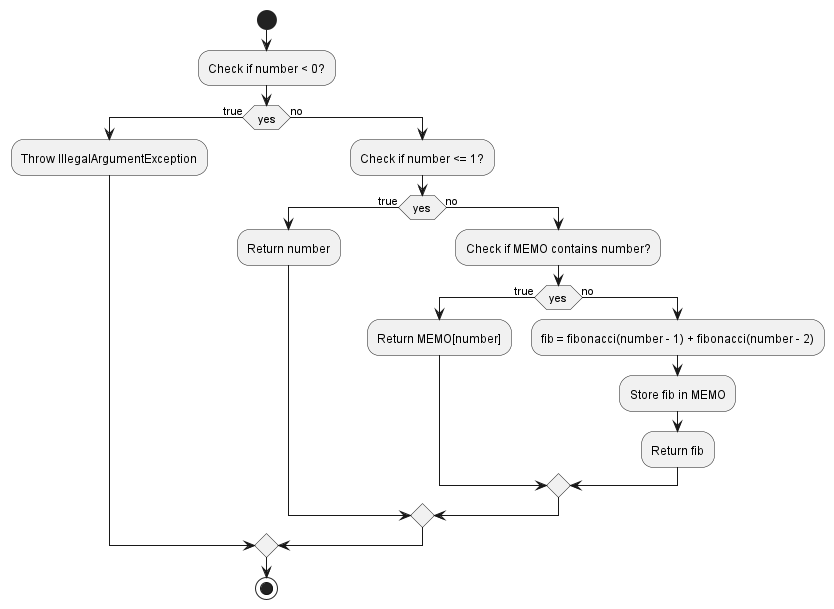

# FibonacciDP

- Spatial Complexity: O(n)
- Time Complexity: O(n)

# FibonacciIteration

- Spatial Complexity: O(1)
- Time Complexity: O(n)

# FibonacciRecursion

- Spatial Complexity: O(n)
- Time Complexity: O(2^n)

